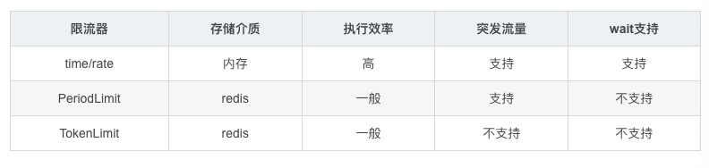

# sourceGo

Singleflight

限流

在限流中有两个概念需要了解
阈值：在一个单位时间内允许的请求量。如 QPS 限制为10，说明 1 秒内最多接受 10 次请求。
拒绝策略：超过阈值的请求的拒绝策略，常见的拒绝策略有直接拒绝、排队等待等。

固定窗口算法 又叫计数器算法
滑动窗口算法 https://github.com/RussellLuo/slidingwindow

漏桶算法   github.com/uber-go/ratelimit 漏桶强调匀速
令牌桶算法  golang.org/x/time/rate  github.com/juju/ratelimit

Redis 分布式限流 go-redis支持限流 也支持分布式锁

分布式限流工具，如阿里开源的 Sentinel 就是不错的工具，Sentinel 以流量为切入点，从流量控制、熔断降级、系统负载保护等多个维度保护服务的稳定性

https://go-zero.dev/ go-zero限流组件在core/limit下

https://github.com/Saurav1999/sliding-window-rate-limiter
Limit by API endpoint
Limit by IP
Limit by Custom user identifier like X-User-Id, Authorization token, etc.
